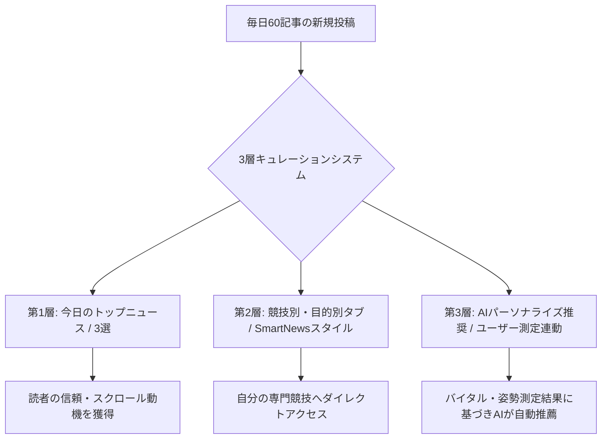

# スポーツバイオメカニクス・ポータル運用戦略＆多言語設計案
**〜 毎日60記事の大量配信を埋もれさせず、日本人の感性に響かせる多言語ポータル設計 〜**

## 1. 課題解決の基本方針（3層キュレーション構造）
各種目毎日10記事（6競技 × 10 = 毎日60記事）という高頻度な更新は、SEO（検索エンジン最適化）には極めて有利ですが、そのままタイムラインに流すと**「情報過多（情報ノイズ）」**になり、ユーザーが離脱する原因になります。
ユーザーの「読みたい」を引き出すため、ポータルを以下の**「3層のキュレーション構造」**で設計します。



### 【第1層】「今日の厳選トップ記事」（エディターズ・ピック）
*   **配置:** 画面最上部にスライドまたはカルーセルで大きく配置（1〜3記事）。
*   **役割:** その日の最も信頼性が高く、万人受けする「怪我予防」や「注目バイオメカニクス」を編集部がピックアップ。まずここだけ見れば良いという安心感を提供します。

### 【第2層】「スマートタブ・チャンネル」（SmartNews / Gunosyスタイル）
*   **配置:** スワイプで切り替え可能な上部ヘッダー（サッカー、野球、テニス...）。
*   **役割:** 競技別のほか、「怪我予防」「パフォーマンス向上」「バイタル健康管理」などの目的別で動的に切り替え。1記事あたり3〜4行の要約（TL;DR）をつけ、スクロールしながら流し読み（スキャン）できるレイアウトにします。

### 【第3層】「測定データ連動型 AIレコメンド」（パーソナライズ）
*   **配置:** ユーザーのマイページ、またはレポートカードの直下。
*   **役割:** ユーザーがカメラで測定した「姿勢の歪み（ニーイン、反り腰など）」や「ストレス値（HRV）」に基づき、**「今のあなたに必要なアプローチ記事」**を過去アーカイブ（数千記事）からAIが自動抽出し提案。「自分ごと」化することで開封率を飛躍的に高めます。

---

## 2. 日本人の感性に馴染むUX/UIデザインの最適解

欧米の「余白を重視したミニマリズム」は、日本市場では「情報が少なくて手抜きに見える」「怪しい」と感じられる傾向があります。日本で好まれるポータルは**「高い情報密度」**と**「圧倒的な信頼・安全性シグナル」**が特徴です。

### ① 「文字の可読性」と「ビジュアルアイコン」の調和
*   **フォント:** 日本語が美しく見える `Noto Sans JP` または `Inter` との掛け合わせ。
*   **アイコン:** 各見出しに絵文字やピクトグラム（⚽, ⚾, 🏥, ⏱️）を必ず添え、視覚的なインデックス（目印）にします。
*   **要約（Pill tags）:** 記事カードのアイキャッチ内に、「論文根拠あり」「3分で読める」「大臀筋」「初心者向け」といったタグ（バッジ）を整理して並べます。

### ② 「専門家の顔」による社会的証明（Social Proof）
*   著者が「編集部」や「AI」のままだと信頼されません。「理学療法士 田中」「公認トレーナー 佐藤」などの**顔写真付きプロフィール、保有資格、専門分野**を記事カードや詳細ページに小さく明記し、「誰が書いたか」を保証します。

### ③ 「体験の完結（Hook & Loop）」
*   記事を読む（インプット）だけで終わらせず、記事末尾に「📸 このアライメントを測定する」ボタンを配置し、アプリ内のAIカメラ測定（アウトプット）へ誘導。測定結果から再び別の記事へループさせることで、エンゲージメントを高めます。

---

## 3. 多言語化（日本語・英語）のアーキテクチャ設計

将来的なグローバル展開を見据え、SEOに強く、運用コストの低い多言語化設計を導入します。

### ① ディレクトリ/サブドメイン構造（SEO対策）
翻訳を単純なJavaScriptの切り替え（クライアントサイド）だけで行うと、検索エンジンのクローラーが他言語ページをインデックスできません。
*   **推奨構造:** `https://example.com/ja/` (日本語版) と `https://example.com/en/` (英語版) にURLを分割。
*   **メタタグ:** `<link rel="alternate" hreflang="ja" href="..." />` および `<link rel="alternate" hreflang="en" href="..." />` を自動生成し、Googleに正しい言語ページを伝えます。

### ② データベース・コンテンツモデル
記事データベースは、言語ごとにテーブルを分けるのではなく、1つのIDに対して言語ごとのデータを格納する構造にします。
```json
{
  "article_id": "art_20260706_01",
  "publish_date": "2026-07-06",
  "category": "soccer",
  "author_id": "trainer_satoh",
  "languages": {
    "ja": {
      "title": "サッカーのキック動作における軸足アライメント",
      "summary": "インステップキック時のニーイン防止と股関節...",
      "content": "..."
    },
    "en": {
      "title": "Support Leg Alignment in Soccer Kicking Actions",
      "summary": "Preventing knee valgus during instep kicks...",
      "content": "..."
    }
  }
}
```

### ③ AIを活用した「ローカライズ」フロー（翻訳運用の自動化）
毎日60記事を人間の翻訳者だけで翻訳するのはコスト面で不可能です。
1.  **AI自動一次翻訳（LLM API）:** 記事登録時に、GPT-4やGemini APIを介して、専門用語（バイオメカニクス等）の辞書を適用した一次英訳を自動作成。
2.  **専門家によるレビュー（重要記事のみ）:** アクセス数が多くなりそうな「トップニュース（第1層）」のみ、現地のトレーナーや理学療法士が目を通して微修正。
3.  **多言語対応用語集（Glossary）の整備:** 「ニーイン（Knee Valgus）」「前十字靭帯（ACL）」などの専門用語の対比表をAIに事前に学習させておくことで、機械的な直訳エラーを防ぎます。

---

## 4. ポータル運用におけるAIアシスタントの活用

編集者の負担を減らすため、以下の記事制作プロセスを自動化します。

*   **AI要約ジェネレーター:** 本文を書くだけで、日本語120文字要約、英語150文字要約、SNSシェア用テキスト（X / LINE）を自動生成。
*   **自動タグ付け機能:** 本文内のキーワードから、自動的に競技カテゴリ（サッカー、陸上）、対象部位（膝、骨盤）、目的（怪我予防）のメタタグを生成してデータベースへ登録。
*   **アイキャッチ画像の自動推薦:** Unsplash等のAPIと連携し、自動で最適なイメージ写真を提案。

---

## 5. UIワイヤーフレーム提案（スマートフォンビュー）

```
+-------------------------------------------------------+
|  [ CORE CONNECT ]               [🌐 JA / EN] [👤 Mypage]|
+-------------------------------------------------------+
|  ⚽ サッカー | ⚾ 野球 | 🎾 テニス | 🏀 バスケ | 🏃 陸上    | < スライド可能タブ
+-------------------------------------------------------+
|                                                       |
|  【TODAY'S PICK】                                     |
|  +-------------------------------------------------+  |
|  |               [ 注目バイオメカニクス ]           |  |
|  |  サッカー・陸上選手向け: 心拍変動(HRV)の科学       |  |
|  |  (理学療法士監修 / 論文根拠あり)                 |  |
|  +-------------------------------------------------+  |
|                                                       |
|  【あなたへのおすすめ (姿勢測定からAI推薦)】           |
|  +-------------------------------------------------+  |
|  | 📸 右足重心のあなたに: 右股関節の可動域向上記事   |  |
|  +-------------------------------------------------+  |
|                                                       |
|  【最新記事一覧 - タイムライン】                       |
|  +-------------------------------------------------+  |
|  | ⚽ [怪我予防] サッカーのインステップキック姿勢... |  |
|  | ✍️ PT 田中  ⏱️ 3min  [📸 AI測定に連動]           |  |
|  +-------------------------------------------------+  |
|  | ⚾ [投球分析] 肩甲骨アライメントと野球肘予防...   |  |
|  | ✍️ トレーナー 佐藤  ⏱️ 4min                       |  |
|  +-------------------------------------------------+  |
+-------------------------------------------------------+
```
